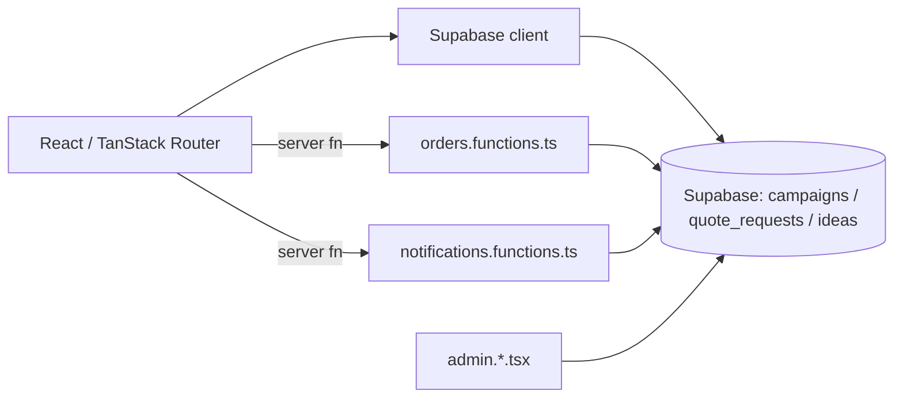

# ARCHITECTURE — mapa dla obcego (1 strona)

**Status: prototype (2026-08) — not maintained.** Ten dokument opisuje kod TAKI, JAKI JEST.

## Co to jest (3 zdania)
Usługa kup-i-wyślij dla MAS Logistics: klienci w Islandii, dla których europejski sklep nie
wysyła do Islandii, mogą złożyć wycenę indywidualną, dołączyć do wspólnej kampanii kontenerowej
("group order" — kilku klientów dzieli koszt frachtu), lub oddać towar na wspólną paletę
("shared pallet"). Osobna tablica pomysłów pozwala klientom proponować produkty do sprowadzenia
hurtowo. Model biznesowy: MAS kupuje, wysyła, odprawia celnie — klient nie wypełnia żadnych
formularzy celnych.

## Stack (z package.json)
- Frontend: React 18 + TypeScript + Vite · TanStack Router/Start (plikowy routing w `src/routes/`)
- Styl: Tailwind CSS + Radix UI (shadcn/ui) + Framer Motion
- Backend/DB: Supabase (Postgres + Auth + RLS), 7 migracji — lekko rozwinięty schemat
- Brak Supabase Edge Functions — cała logika po stronie klienta + `src/utils/*.functions.ts`
  (TanStack Start server functions)
- Hosting: Lovable

## Moduły i granice
| Katalog | Odpowiedzialność | Wejście | Tier |
|---|---|---|---|
| `src/routes/index.tsx` | strona główna, wycena indywidualna | URL | T2 |
| `src/routes/group-orders.tsx`, `group-orders.$campaignId.tsx` | lista kampanii + strona publiczna jednej kampanii (sloty, depozyt, cel) | URL | T2 |
| `src/routes/shared-pallet.tsx` | intake na wspólną paletę (mniejsze przesyłki) | URL | T2 |
| `src/routes/import.tsx` | formularz wyceny indywidualnego importu | URL | T2 |
| `src/routes/admin.*.tsx` | back office: `admin.campaigns` (kampanie), `admin.quotes` (wyceny), `admin.orders` (zamówienia), `admin.ideas` (tablica pomysłów), `admin.login` | URL, auth | T2 |
| `src/utils/orders.functions.ts` | server functions dla operacji na zamówieniach | wywoływane z routes | T2 |
| `src/utils/notifications.functions.ts` | server functions dla powiadomień | wywoływane z routes | T2 |
| `src/components/IdeaBox.tsx`, `CampaignDialog.tsx` | UI tablicy pomysłów i dialogu kampanii | — | T1 |
| `supabase/migrations/` | schemat + RLS (7 plików: `campaigns`, `quote_requests`, `ideas`, zamówienia) | — | T3 |

## Przepływ danych

## Gdzie jest…
- autoryzacja: Supabase Auth + RLS; panel admina za loginem (`admin.login.tsx`)
- ceny/kwoty: `Campaign.deposit_amount` / `unit_price_estimate` / `currency` — na poziomie
  rekordu kampanii w bazie, nie hardcoded w kodzie (inaczej niż w `project-renew-spark`)
- statusy: proste stringi (`quote_requests.status`, `ideas.status`) z lokalnym mapowaniem kolorów
  w komponencie — brak wspólnego pliku statusów jak `status.ts` w `ekomoc`
- i18n: brak — UI wyłącznie po angielsku
- sekrety: `.env` trzyma tylko publiczny klucz Supabase; brak edge functions więc brak
  serwerowych sekretów w tym repo
- CI: `.github/workflows/quality.yml` — zdjęte razem z oznaczeniem prototypu, przywrócone tym PR
  po zielonym przebiegu lokalnym

## Decyzje nieodwracalne
`docs/adr/` — tylko szablon, brak formalnych ADR w trakcie życia projektu.

## Jak to cofnąć / kill switch
Prototyp wygaszony (status: not maintained). Brak edge functions i płatności na żywo — repo jest
czysto referencyjne, nie ma nic do wyłączenia w produkcji.
